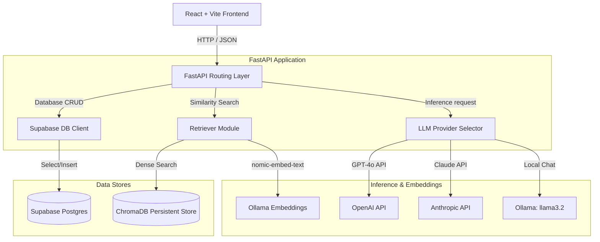

# Technical Architecture Specification

## Project: Lenny Growth Assistant

This document outlines the software architecture, database schemas, local vector indexes, API routing namespaces, and multi-provider LLM pipelines.

---

## 1. System Topology & Data Flow



---

## 2. Database Schema (Supabase PostgreSQL)

The database schema manages user conversations, historical sessions, and chat log metrics.

### 2.1 Chat Sessions Table (`chat_sessions`)
Stores the metadata for each chat session.
```sql
CREATE TABLE chat_sessions (
    id UUID PRIMARY KEY,
    title VARCHAR(255) NOT NULL,
    created_at TIMESTAMP WITH TIME ZONE DEFAULT NOW(),
    updated_at TIMESTAMP WITH TIME ZONE DEFAULT NOW()
);
```

### 2.2 Chat Messages Table (`chat_messages`)
Stores each message exchange, including model metadata and citation reference metrics.
```sql
CREATE TABLE chat_messages (
    id UUID PRIMARY KEY DEFAULT gen_random_uuid(),
    session_id UUID REFERENCES chat_sessions(id) ON DELETE CASCADE,
    role VARCHAR(50) NOT NULL, -- 'user' or 'assistant'
    content TEXT NOT NULL,
    citations JSONB DEFAULT '[]'::jsonb, -- list of cited source paths
    model_used VARCHAR(100) NOT NULL, -- e.g. 'openai', 'anthropic', 'ollama'
    created_at TIMESTAMP WITH TIME ZONE DEFAULT NOW()
);
```

---

## 3. API Endpoints Specification

FastAPI routes are defined under a central router mounted at `/` (root level) to align with existing API contracts:

| Path | Method | Payload / Response | Description |
| :--- | :--- | :--- | :--- |
| **`/health`** | `GET` | `{"status": "healthy"}` | Service status check |
| **`/sessions`** | `POST` | Input: `{"title": "..."}`<br>Output: `Session` object | Creates a session |
| **`/sessions`** | `GET` | Output: `List[Session]` | Fetches all session logs |
| **`/sessions/{id}/messages`** | `GET` | Output: `List[Message]` | Fetches chat history for session |
| **`/chat`** | `POST` | Input: `{"session_id": "...", "message": "...", "provider": "..."}`<br>Output: `ChatResponse` | Main RAG conversation pipeline |

### 3.1 `ChatResponse` Model Structure
```json
{
  "response": "LLM generated markdown response...",
  "answer": "LLM generated markdown response...",
  "retrieved_sources": [
    {
      "page_content": "transcript snippet...",
      "metadata": {
        "guest": "Shreyas Doshi",
        "title": "Transcript",
        "source_path": "data/lenny_transcripts/episode_1.md",
        "chunk_number": 12
      }
    }
  ],
  "session_id": "session_123"
}
```

---

## 4. RAG Pipeline & ChromaDB
The RAG pipeline extracts context from transcript files to formulate replies:
1.  **Deduplicated Ingestion (`ingest.py`):** Clones podcast transcripts to `data/lenny_transcripts/`. Splits texts using `RecursiveCharacterTextSplitter` (chunk size: 1000 characters, overlap: 200). Generates a deterministic hash key (`sha256(filepath + chunk_number)`) for each chunk. Batches uploads in size of 100, querying ChromaDB `vectorstore.get(ids=...)` first to skip duplicates.
2.  **Persistent ChromaDB Storage (`vectordb.py`):** Configures local SQLite persistent database storage using `PersistentClient` in `CHROMADB_PATH` under a collection named `lenny_transcripts`.
3.  **Local Ollama Embeddings (`embedder.py`):** Interfaces with local Ollama service (`http://localhost:11434`) running the `nomic-embed-text` model to embed texts in 768-dimensional space.
4.  **Vector Retrieval (`retriever.py`):** Exposes `retrieve(query, k=5)` which queries ChromaDB using similarity search and returns the top 5 chunks.

---

## 5. Session Management & LLM Routing
*   **Session Checks (`chat_service.py`):** Every user message triggers `supabase_db.save_message(session_id, "user", message)`. If the session ID doesn't exist, it automatically registers it.
*   **Prompt Routing & Writing Skills:**
    *   Checks if the user's question query contains keywords matching `"ship30"`, `"write like ship30"`, `"essay"`, `"twitter thread"`, or `"long-form post"`.
    *   If matched, overrides standard system prompts and routes queries to the **Ship30 dedicated template** to compile atomic skimmable posts of 1200-1300 words with bolded takeaways and hooks.
    *   If not matched, routes queries to the standard **Lenny Assistant template**.
*   **Model Invocation:** Resolves provider strings to instantiate Chat wrappers:
    *   `openai` -> `ChatOpenAI(model="gpt-4o")`
    *   `anthropic` -> `ChatAnthropic(model="claude-3-5-sonnet")`
    *   `ollama` -> `ChatOllama(model="llama3.2")`
    Calls model asynchronously using `.ainvoke` inside async routing context.
